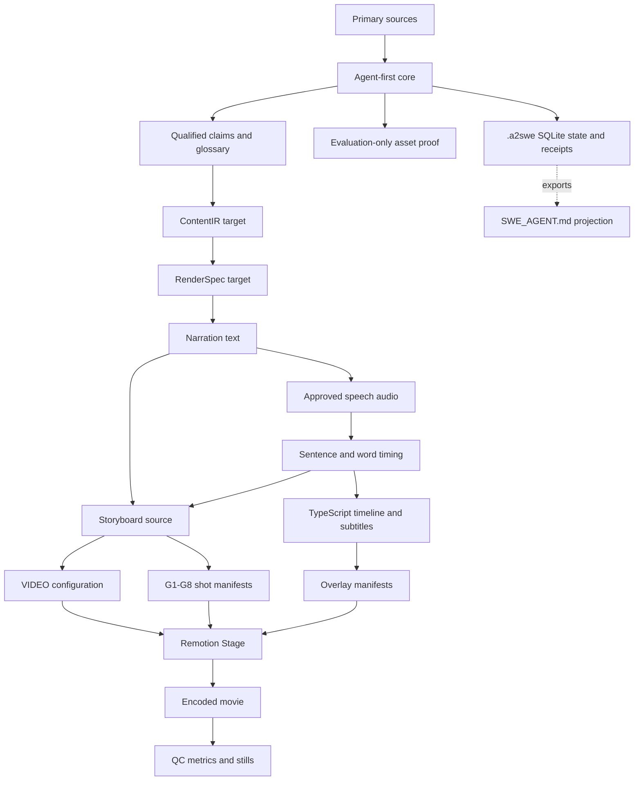

# Data flow

## Orchestrated content and adapter transformation



## Authoritative data

| Concern | Authoritative artifact |
| --- | --- |
| Claims and qualifications | `research/research.md` |
| Spoken content | `script/narration.txt` |
| Timing | generated timeline data and verified audio duration |
| Editorial scene intent | `script/storyboard_src.md` |
| Resolved production plan | `storyboard.md` |
| Runtime content | `src/config.ts`, timeline, subtitles, shot manifests |
| Asset rights | `asset-manifest.json` |
| Core runtime state | `.a2swe/` SQLite store, receipts, and content-addressed artifacts |
| Video project projection | `agent/SWE_AGENT.md` |
| Release inventory | `delivery.md` |

## Frame timing

Seconds convert to frames using the project frame rate:

```text
frame = round(seconds × FPS)
```

At 30 fps, a 30-second pilot covers frames 0 through 899. Sequence intervals should use a consistent inclusive/exclusive convention within the manifests to prevent single-frame gaps or overlaps.

## Change propagation

Narration changes have the largest propagation radius. They require renewed approval, speech regeneration or replacement, fresh timing, subtitle realignment, storyboard review, scene-window review, rerendering, and QC. Visual-only fixes can restart at the affected build stage if narration and timing remain unchanged.
