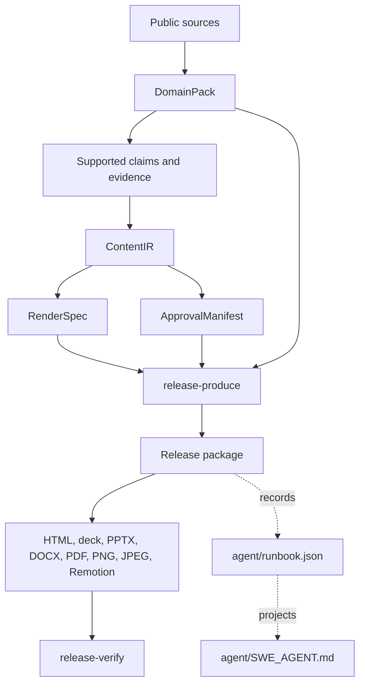

## Core data flow

```mermaid
flowchart TD
  Sources[Public sources] --> DomainPack[DomainPack]
  DomainPack --> Claims[Supported claims and evidence]
  Claims --> ContentIR[ContentIR]
  ContentIR --> RenderSpec[RenderSpec]
  ContentIR --> ApprovalManifest[ApprovalManifest]
  RenderSpec --> Release[release-produce]
  ApprovalManifest --> Release
  DomainPack --> Release
  Release --> Package[Release package]
  Package --> Outputs[HTML, deck, PPTX, DOCX, PDF, PNG, JPEG, Remotion]
  Outputs --> Verify[release-verify]
  Package -. records .-> Runbook[agent/runbook.json]
  Runbook -. projects .-> Ledger[agent/SWE_AGENT.md]
```

## Authoritative artifacts

| Concern | Authoritative artifact |
| --- | --- |
| Domain identity and freshness window | `domain-pack.json` |
| Supported claims and evidence | `domain-pack.json` |
| Audience, decision, sections, narration, and citations | `content-ir.json` |
| Format selection and video dimensions | `render-spec.json` |
| Selected-asset disposition | `approval-manifest.json` |
| Release digests and formats | `release-plan.json` |
| Output digests and media types | `parity-manifest.json` |
| Workflow state | `agent/runbook.json` |
| Human-readable workflow projection | `agent/SWE_AGENT.md` |

## Timing propagation

Narration changes have the widest downstream impact. They can require regenerated
speech, updated scene timing, updated captions, and rerendered output. Visual-only
changes can stay scoped to the affected output set when narration and timing remain
unchanged.

## Legacy note

The older template path keeps its own storyboard, shot-group, and 720p timing
artifacts. Treat that path as legacy and separate from the core data flow above.
