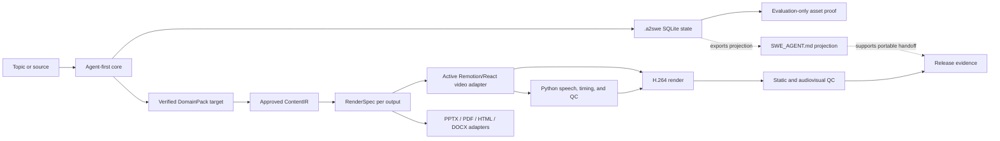

# System architecture

The architecture has one orchestrated production model: core state and approvals produce ContentIR and RenderSpec records, then format adapters create reviewable outputs. The active Remotion/React and Python speech/QC video adapter, evaluation-only asset proof pipeline, and planned PPTX/PDF/HTML/DOCX adapters belong to that model rather than separate product lines. Production release remains gated by evidence, rights, independent QA, and human approval.

## Workflow plane

The workflow plane defines stages, dependencies, assignments, approvals, evidence, blockers, and next actions. For the agent-first core, durable state is the `.a2swe/` SQLite store plus content-addressed artifacts and receipts. For video projects, `agent/SWE_AGENT.md` is a portable projection used for human handoff; it must not override core state. Research, narration, storyboards, QC results, manifests, and delivery notes are first-class artifacts rather than transient chat context.

## Runtime plane

The active video runtime plane is a Remotion composition graph backed by Python speech, timing, and QC:

1. `src/index.ts` registers `Root`.
2. `Root.tsx` publishes named compositions.
3. `Main.tsx` merges overlay and group manifests.
4. `Stage` renders audio, background, footage, shots, progress, and subtitles in layer order.
5. Remotion evaluates the React tree for each frame.
6. FFmpeg encodes the rendered frames and audio.

## Configuration plane

Project variation is primarily data-driven:

- `src/config.ts` defines identity, chapter, HUD, rail, background, ending, and credit content;
- `src/common/timeline.ts` defines sentence and chapter timing;
- `src/common/subs.ts` defines subtitle cues;
- `src/shots/G*/` defines authored scene groups;
- `public/assets/<slug>/` supplies project media.

## Trust boundaries

- Source claims become narration only after research qualification.
- Narration becomes external speech input only after explicit disclosure and approval.
- Automated checks can measure artifacts but cannot manufacture human approval.
- Optional media must include source, license, digest, and usage records.
- The companion must not contain credentials or unverified claims of success.
