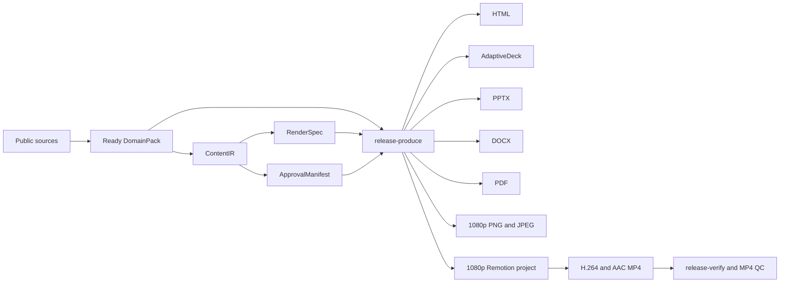

## System architecture

The current architecture has one shared core contract model. A ready domain pack,
matched content, matched render spec, and matched approval manifest feed the same
release package.

```mermaid
flowchart LR
  Sources[Public sources] --> Domain[Ready DomainPack]
  Domain --> ContentIR[ContentIR]
  ContentIR --> RenderSpec[RenderSpec]
  ContentIR --> Approval[ApprovalManifest]
  Domain --> Release[release-produce]
  RenderSpec --> Release
  Approval --> Release
  Release --> Html[HTML]
  Release --> Deck[AdaptiveDeck]
  Release --> Pptx[PPTX]
  Release --> Docx[DOCX]
  Release --> Pdf[PDF]
  Release --> Raster[1080p PNG and JPEG]
  Release --> Remotion[1080p Remotion project]
  Remotion --> Mp4[H.264 and AAC MP4]
  Mp4 --> Verify[release-verify and MP4 QC]
```

## Shared records

The core release package writes:

- `content-ir.json`
- `domain-pack.json`
- `render-spec.json`
- `approval-manifest.json`
- `release-plan.json`
- `parity-manifest.json`

These digests are the release authority. They are not publication authorization.

## Output adapters

The core can generate:

- self-contained HTML
- AdaptiveDeck JSON
- editable PPTX
- editable DOCX
- searchable PDF
- 1080p PNG and JPEG overview images
- a generated Remotion project that renders the final MP4 locally

When the content includes section visuals and the format set includes `remotion`,
the renderer emits settled diagram PNGs and the document adapters embed those PNGs.

## Runtime authority

The `.a2swe/` store holds local runtime state, receipts, and artifacts.
`agent/runbook.json` is the machine-readable workflow projection.
`agent/SWE_AGENT.md` is the human-readable projection.

None of those files publish output or grant reuse rights.

## Legacy note

The older 720p template remains a separate path under `template/`. It is not the
managed release path described here.
