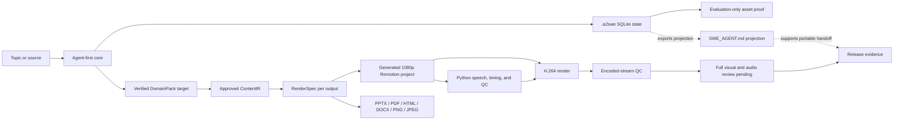

## System architecture

The architecture has one shared contract model: core state and approvals
govern ContentIR and RenderSpec records, then adapters create reviewable
outputs. The core can generate HTML, AdaptiveDeck, editable PPTX/DOCX,
searchable PDF, 1080p PNG/JPEG overviews, and a separate 1080p Remotion
project. Supplied raster assets are digest-checked and embedded where
supported. Production packaging remains gated by evidence, approval, and
signed approvals; the encoded MP4 and native visual review are separate
steps. The older 720p template remains a distinct, unmigrated workflow.

```mermaid
flowchart LR
  Request[Topic or source] --> Core[Agent-first core]
  Core --> Store[.a2swe SQLite state]
  Store --> Proof[Evaluation-only asset proof]
  Core --> Domain[Verified DomainPack target]
  Domain --> ContentIR[Approved ContentIR]
  ContentIR --> RenderSpec[RenderSpec per output]
  RenderSpec --> Remotion[Generated 1080p Remotion project]
  RenderSpec --> Outputs[PPTX / PDF / HTML / DOCX / PNG / JPEG]
  Remotion --> Encode[H.264 render]
  Remotion --> Python[Python speech, timing, and QC]
  Python --> Encode
  Encode --> QC[Encoded-stream QC]
  QC --> Review[Full visual and audio review pending]
  Review --> Delivery[Release evidence]
  Store -. exports projection .-> Ledger[SWE_AGENT.md projection]
  Ledger -. supports portable handoff .-> Delivery
```

## Workflow plane

The workflow plane defines stages, dependencies, assignments, approvals, evidence, blockers, and next actions. For the agent-first core, durable state is the `.a2swe/` SQLite store plus content-addressed artifacts and receipts. For video projects, `agent/SWE_AGENT.md` is a portable projection used for human handoff; it must not override core state. Research, narration, storyboards, QC results, manifests, and delivery notes are first-class artifacts rather than transient chat context.

## Runtime plane

The active video runtime plane is a Remotion composition graph backed by Python speech, timing, and QC:

1. `src/index.ts` registers `Root`.
2. `Root.tsx` publishes named compositions.
3. `Main.tsx` merges overlay and group manifests.
4. `Stage` renders audio, background, footage, shots, progress, and subtitles in layer order.
5. Remotion evaluates the React tree for each frame.
6. FFmpeg encodes the rendered frames and audio.

## Configuration plane

Project variation is primarily data-driven:

- `src/config.ts` defines identity, chapter, HUD, rail, background, ending, and credit content;
- `src/common/timeline.ts` defines sentence and chapter timing;
- `src/common/subs.ts` defines subtitle cues;
- `src/shots/G*/` defines authored scene groups;
- `public/assets/<slug>/` supplies project media.

## Trust boundaries

- Source claims become narration only after research qualification.
- Narration becomes external speech input only after explicit disclosure and approval.
- Automated checks can measure artifacts but cannot manufacture human approval.
- Optional to provide additional media source metadata, license, digest, etc.
- The companion must not contain credentials or unverified claims of success.
